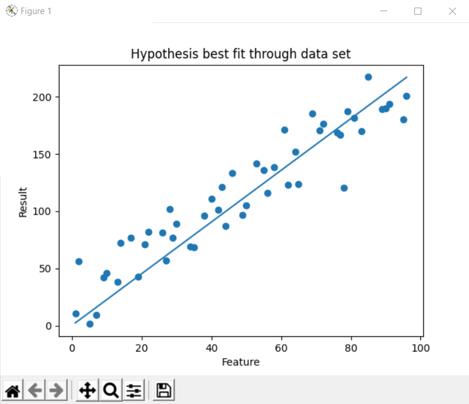
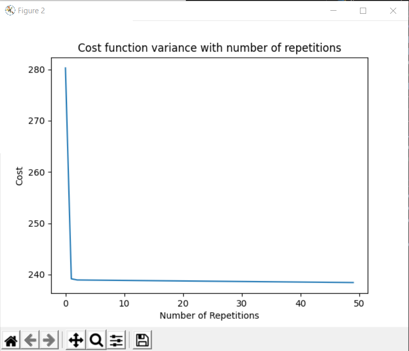

<h1>Implementation of Linear Regression and Gradient Descent Without External Libraries</h1>
<table>
    <tr>
        <td>
            <h2>Overview</h2>
            
In this task, I have implemented linear regression and gradient descent in an iterative manner in order to do it without the help of external libraries. The algorithm functions properly and returns the expected results. However, it is obviously better to implement this in a vectorized way. This was just to make sure I compeltely grasp the concept.

        </td>
    </tr>
    <tr>
        <td>
            <h2>Results</h2>
            
The algorithm starts out with initial parameters <strong>theta = [0, 0]</strong>. After running gradient descent 50 times for an alpha value of <strong>alpha = 0.0003</strong>, a minimum is found at parameters <strong>theta = [012455766443793956, 2.2592011590562677]</strong>

            
This is a plot showing the hypothesis best fit line through the data set:
            
    
            
            
This is a plot showing the variance of the cost with the number of repetitions of gradient descent:
            
    
            
        </td>
    </tr>
</table>